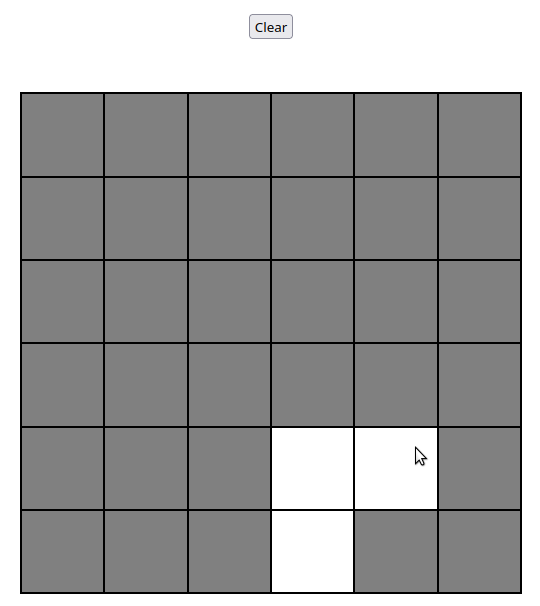

# Etch-a-Sketch
This is an implementation of something between a sketchpad and Etch-a-Sketch for a web browser.
## Description

This project only made use of html and javascript with the goal of getting better at using it in manipulating the DOM. There is an option of changing the number of pixels in the grid when the clear button is pressed. The project was provided by [the odin project](https://www.theodinproject.com/paths/foundations/courses/foundations/lessons/etch-a-sketch-project). The site can be seen [here](https://libmartinito.github.io/eas).
